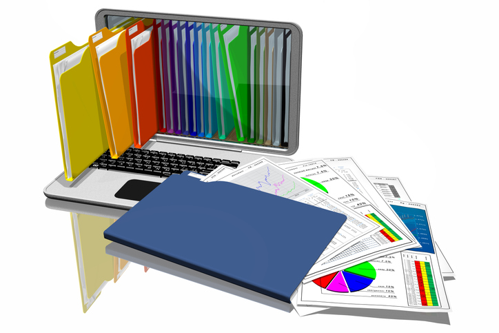
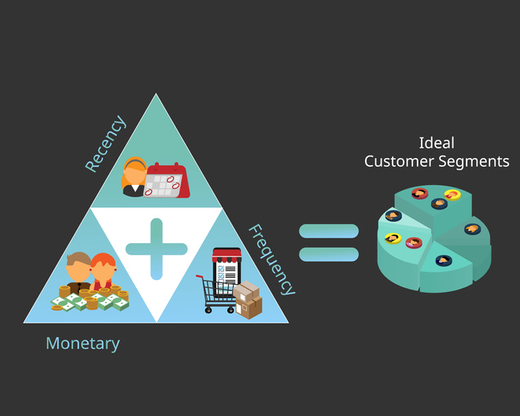
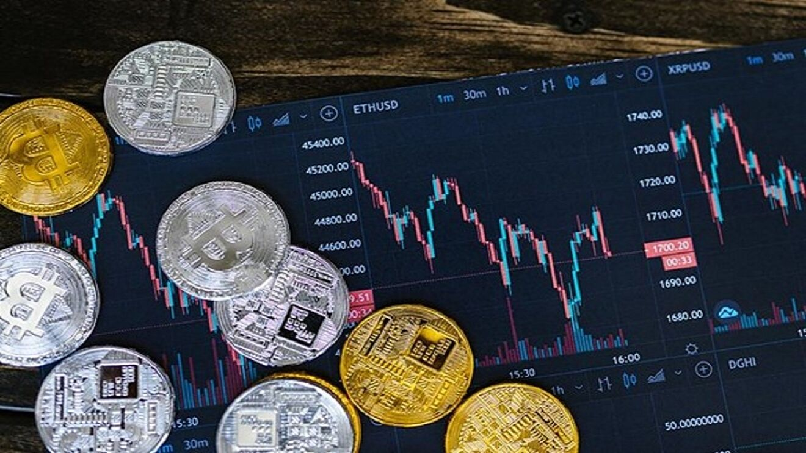

# Welcome to my Data Science Portfolio Playground!!! 

 

Transitioning from a solid engineering background to the field of data analytics, this portfolio is a testament to my dedication and enthusiasm for understanding and working with data. Over the years, my engineering expertise has laid a strong foundation for analytical thinking and problem-solving. Building upon this, I've expanded my skills to incorporate various aspects of data science, ranging from machine learning (both supervised and unsupervised), data preprocessing, exploratory data analysis, to predictive modeling and data visualization using tools like python and power BI respectively. 

# Overview

This portfolio showcases a range of projects where I have applied my data analytics skills across different business use cases in domains like E-commerce, real estate, banking etc. Each of these projects has enriched my data science expertise, allowing me to effectively leverage data in innovative ways. 

# Project 1: Customer Segmentation with RFM Analysis using Python 
 

### Background

Frequently asked questions by your manager in Sales/Marketing Department if you do not meet sales target:
- "It costs 5 times more to attract a new customer than retaining a current customer"
- "20% of your customers generate 80% of your revenue"
- "Our customer base is increasing but reveune isn't!"
### The ultimate question is "Do you know your customers?"

In fact that many companies still do not know their customers properly as there is no system in place to manage existing customers. They generate thousands of customer databases, but they do not analyze it at regular intervals. They usually use the old methods when examining customer data in sales or marketing departments.

### "If your retention is poor then nothing else matters." Brian Balfour, Founder/CEO of REforge

The best way to get to know your customers is through customer segmentation.
Customer segmentation is the process of diving customers into groups or segments with respect to common characteristics.
This helps target each group of customers to improve their contribution to the business and provide them with a better customer experience.
Also, the companies can focus their energy, costs, and attention on particular segments by using customer segmentation.

We can use the RFM analysis to determine customer segmentation and create a system to ensure proper retention. 

### What is RFM Analysis?
 

RFM analysis helps marketers identify their loyal & profitable customers. In addition, the analysis shows which customers are more likely to be loyal in the future and who are likely to lapse. In short, you get to predict how customers will behave in the future based on existing data.

RFM analysis focuses on three main aspects of customers:

· Recency — How recently did the customer purchase?

· Frequency — How often do they purchase?

· Monetary Value — How much do they spend?

This project involves turning RFM segmentation into a powerful marketing technique for uncderstanding customer behaviour and driving revenue growth. RFM enables customers to be divided into groups based on their purchasing behaviors and companies to develop strategies specific to these groups. It can create a culture of nurturing existing customers. In a world where new acquisition is viewed very favorably (and rightly so), it’s easy to lose sight of existing customers. Having an active RFM model doesn’t allow us to do that.

* **Python libraries used:** pandas, matplotiib, pycaret
* **Input:** “Online_retail.csv” from UCI Machine Learning Repository data (https://archive.ics.uci.edu/ml/datasets/Online+Retail+II) 
* **Output:** RFM Analysis for customer segmentation. 

Here is link for the code book: https://github.com/fireearth88/Portfolio/blob/main/Projects/notebooks/RFM_analysis.ipynb 

# Project 2: Crypto Trading Bot

 

This project makes use of ***sentiment analysis*** of cryptocurrency coupled with ***technical analysis*** in the trading of cryptocurrencies.
* **Python libraries used:** Streamlit, python-binance, cctx, talib
* **Input:** Cryptocurrency historical price
* **Output:** Trading signals triggers buying and selling

